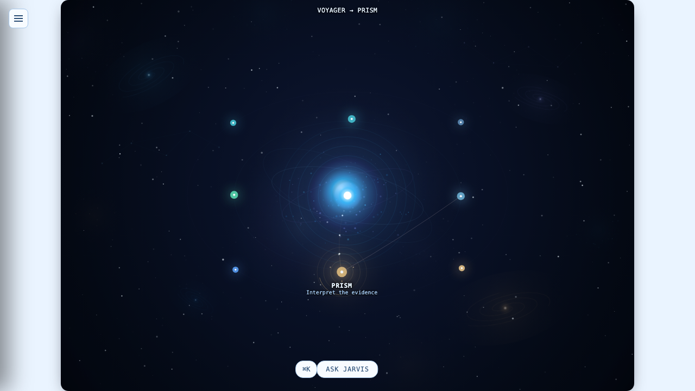
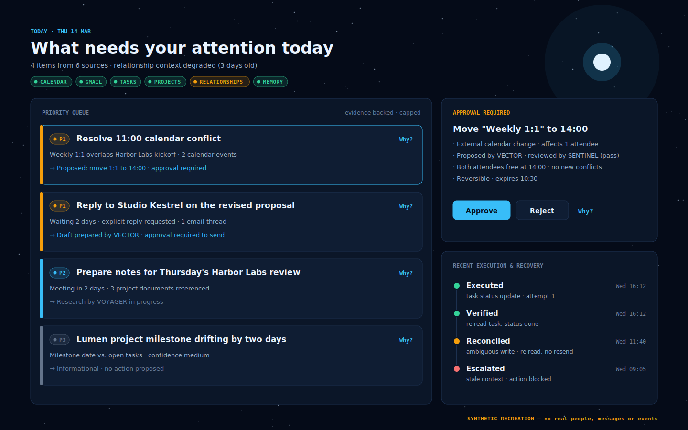
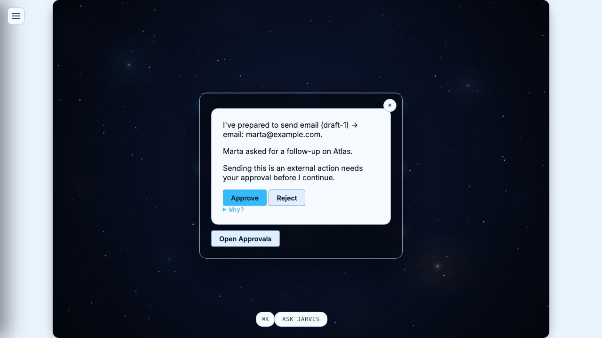
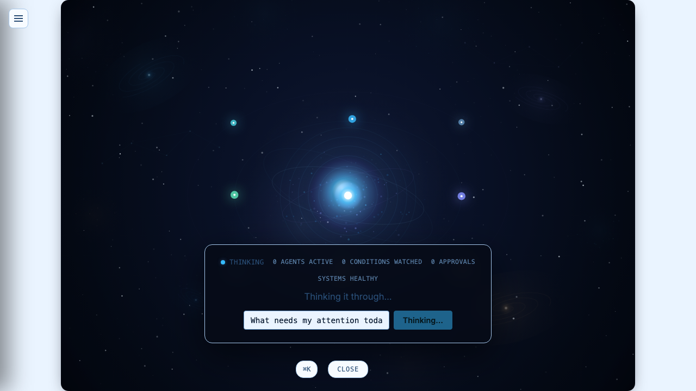
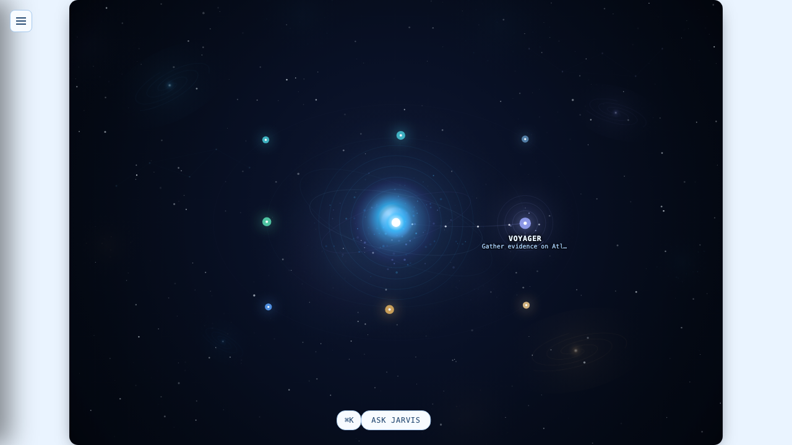
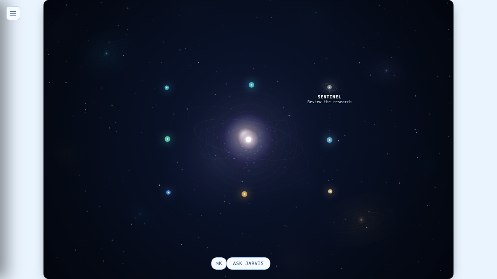

<div align="center">

# JARVIS OS

**A personal AI operating system that answers one question every morning:
_what needs my attention today?_**

It collects context from calendar, email, tasks, projects, relationships and memory. It decides what deserves attention, coordinates a team of bounded specialist agents, and only acts through governed, verifiable, recoverable actions under explicit human approval.

   



<sub>The Agent Galaxy: JARVIS is the central body, and each specialist agent is a star. Here the research agent hands evidence to the analyst. All data in these screenshots is synthetic.</sub>

</div>

---

> **Public repository scope.** This is the public architecture and engineering showcase of JARVIS OS. The full system lives in a private monorepo, with personal integrations, production policies and private data. This edition documents how the system is designed and why, through re-authored docs, illustrative TypeScript contracts and fully synthetic examples. [More below](#public-repository-scope).

## Why it exists

Knowledge work arrives through too many channels: meetings, threads, commitments, half-finished projects, people waiting on you. Most "AI assistants" answer this by acting more. JARVIS takes the opposite position:

- **Attention is the scarce resource.** The system's first job is to decide what matters and explain why, with evidence. Doing things comes second.
- **Autonomy is earned, not assumed.** Agents propose. A deterministic policy decides what may run automatically, what needs a human, and what is never allowed.
- **Every claim and every action is traceable.** No priority without evidence, no "done" without verification, and no agent activity that isn't observable.

The design rule behind all three: *build the deterministic, permissioned, traced substrate first, and let model reasoning operate strictly inside it.*

## Architecture at a glance

```mermaid
flowchart LR
  subgraph Sources["Context sources"]
    CAL[Calendar]
    GM[Gmail]
    TK[Tasks]
    PJ[Projects]
    RL[Relationships]
    MEM[(Memory)]
  end

  subgraph Attention["Executive policy / attention"]
    COL[Collect & privacy-filter] --> DED[Deduplicate] --> SCO[Evidence-backed scoring] --> SYN[Bounded synthesis] --> VAL[Validate]
  end

  Sources --> COL
  VAL --> Q[[Prioritized work queue<br/>P0 · P1 · P2 · P3]]

  Q --> TEAM[Agent team<br/>plan · research · critique]
  TEAM -->|proposes| GOV{Governed action policy}
  GOV -->|automatic| EXE[Execute]
  GOV -->|needs human| APR[Approval inbox] -->|approved| EXE
  GOV -->|never| BLK[Blocked]
  EXE --> VER[Verify] --> REC[Retry · reconcile · roll back · escalate]
  VER --> EPI[(Episodic memory)]

  TEAM -. trace events .-> OBS[Observability & Agent Galaxy]
  EXE -. trace events .-> OBS
  OBS --> EVAL[Evaluation]
```



One authoritative router sits in front of every capability. One attention engine feeds both the Today view and the Morning Brief. One action pipeline governs every consequential side effect. JARVIS avoids parallel "second paths" on purpose. → [docs/architecture.md](docs/architecture.md)

## Key engineering concepts

| Concept | What it means in JARVIS |
| --- | --- |
| **Evidence-required attention** | An attention item cannot exist without at least one reference to a real source record. Raw email bodies and notes never cross the wire contract. |
| **Deterministic before generative** | Collection, filtering, dedup and baseline scoring are pure and testable. A model only groups, explains and orders a *pre-qualified* set, and its output is validated. |
| **P0–P3 prioritization** | Four bands, from "act now" to "background". A band reflects importance, urgency, confidence, risk, autonomy and notification relevance. |
| **Propose ≠ authorize** | Agents can only produce an action *proposal*. Nothing lets an actor authorize itself. |
| **Autonomy ladder** | Each action type is registered once at a fixed autonomy level, from read-only to destructive. Model reasoning can't raise or lower it at runtime. |
| **Execution ≠ verification** | "The API returned 200" is not "it worked". Verification is a separate fact with its own status. |
| **Fail closed** | Unknown action types, stale context, expired approvals and ambiguous writes stop the action. JARVIS never guesses. |
| **Durable & resumable** | Work survives crashes and restarts without duplicating consequential effects. |
| **Observable by construction** | Workflows, agents and actions all emit one trace-event shape, so one inspector understands all of them. |

## Attention: P0–P3



<sub>Recreated with synthetic data for this public edition. It shows the attention, approval and recovery concepts in one view.</sub>

| Band | Meaning | Typical surface |
| --- | --- | --- |
| **P0** | Needs action now; cost of delay is high | Interrupts; top of brief |
| **P1** | Should be handled today | Morning Brief top priorities |
| **P2** | Worth doing this week; schedule it | Today list |
| **P3** | Background awareness | Collapsed, never notifies |

A band is a judgment over several factors: **importance, urgency, confidence, risk, autonomy, and notification relevance**. The brief is deliberately capped, so JARVIS surfaces a short, defensible list instead of an inbox. → [docs/attention-system.md](docs/attention-system.md)

## Memory

Four kinds of memory, each with its own lifecycle and trust level:

- **Working / task memory**: bounded context for the current run, assembled fresh and discarded afterwards.
- **Episodic memory**: what happened, when, with what outcome, from verified run and action history.
- **Semantic memory**: curated, durable knowledge about people, projects and preferences.
- **Procedural memory**: versioned, verified procedures that agents may select, but that never widen their permissions.

Every record carries **scope, provenance, timestamps and confidence**. Long-term memory is written through *proposals* that a human reviews. Memory alone can never make something urgent. → [docs/memory-system.md](docs/memory-system.md)

## Execution and recovery

```
prepare → execute → verify → retry (if safe) → roll back (if possible) → escalate (when required)
```

Actions are classified along two axes, **reversible vs irreversible** and **automatic vs approval-required**. Irreversible and external actions default to human approval. Destructive actions have no approval path at all in the current phase. Every failure class maps to one explicit strategy (retry, defer, reconcile, fail closed, resume, escalate) instead of a generic "retry everything". → [docs/recovery-model.md](docs/recovery-model.md)

## Human oversight



Approvals are first-class state, not a log line. Each request shows what will happen, to whom, why, and the evidence behind it, with a "Why?" drill-down. Approvals are tied to a single run and they expire. A stale approval is never revived; the action has to be proposed again.

## Evaluation

The system is judged on behavior, not vibes. Deterministic scenario suites cover grounding (no claim without evidence), prompt-injection resistance (retrieved content is data, never instructions), degraded sources, stale context, approval enforcement and recovery paths. Each specialist agent must pass positive *and* negative competence evals before it moves up a maturity ladder. → [docs/evaluation.md](docs/evaluation.md)

## The Agent Galaxy

The primary interface is a living constellation. JARVIS is the central body, and eight specialist agents orbit it as persistent stars. Their state (idle, thinking, working, reviewing, waiting for approval) and their hand-offs are rendered straight from the runtime's truthful state projection, not an animation script.

| Thinking | Working | Reviewing |
| --- | --- | --- |
|  |  |  |

**The team**

| Agent | Role |
| --- | --- |
| **POLARIS** | Manager: decomposes objectives, delegates, integrates |
| **VOYAGER** | Research: gathers evidence from approved context |
| **PRISM** | Analyst: interprets evidence |
| **VECTOR** | Action planner: dependency-aware plans |
| **SENTINEL** | Critic: audits requirements, grounding and results |
| **SIGNAL** | Lead scorer |
| **NEXUS** | CRM manager |
| **FORGE** | Code specialist: the only role with real action authority, and still governed |

→ [docs/agent-runtime.md](docs/agent-runtime.md)

## Synthetic walkthrough

```
08:00  calendar conflict detected            (two meetings overlap at 11:00)
08:02  attention engine creates P1 item       evidence: 2 calendar events
08:03  scheduling proposal from action planner   "move 1:1 to 14:00"
08:05  human approval requested               external change → approval required
08:07  approved action executed               calendar update
08:08  result verified                        re-read confirms new time
08:09  episodic memory recorded               outcome + provenance
```

The full machine-readable version is in [`examples/`](examples/). Every name, time and event in it is synthetic.

## Technical stack

TypeScript monorepo (pnpm + Turborepo) · React + Vite UI · Fastify control plane · Zod runtime contracts · PostgreSQL (Kysely) durable storage with an in-memory adapter · Model Context Protocol (MCP) as the connector boundary · isolated Python multi-agent worker (CrewAI) · Vitest and Playwright (including visual regression) · Vercel.

## Current status

**V1 (pre-HALO) — architecture frozen.** The private system has a durable storage layer, a deterministic multi-agent team, a governed action runtime with the full autonomy ladder, and controlled-mode integrations with Gmail, Calendar, Slack and GitHub. By policy, live external side effects are still disabled deployment-wide. Everything runs in controlled mode while evaluation and recovery are proven. Next up: a local, self-hosted inference boundary ("HALO").

## Repository layout

```
docs/          architecture, attention, agents, memory, recovery, evaluation, principles
interfaces/    illustrative public TypeScript contracts (type-checked, no implementation)
examples/      fully synthetic day / task / agent-run traces
screenshots/   Agent Galaxy captures rendered from synthetic fixtures
```

## Public repository scope

This repository is the public edition of a larger private system. It is meant to show the architecture, the engineering judgment and the product direction.

**Included:** architecture and design documentation written for this edition, simplified illustrative contracts, synthetic examples, and UI captures rendered from synthetic data.

**Intentionally not included:** source code, production policies (priority formulas, weights, thresholds, autonomy assignments), prompts and system instructions, retrieval and ranking heuristics, connector and credential handling, infrastructure configuration, and any personal data. The contracts in `interfaces/` were written from scratch for this edition and are not the production schemas.

This repository has its own history. It was not forked, mirrored or filtered from the private one.

---

<sub>© Raul Mermans · docs CC BY 4.0, code MIT (see [LICENSE](LICENSE)) · [SECURITY.md](SECURITY.md)</sub>
