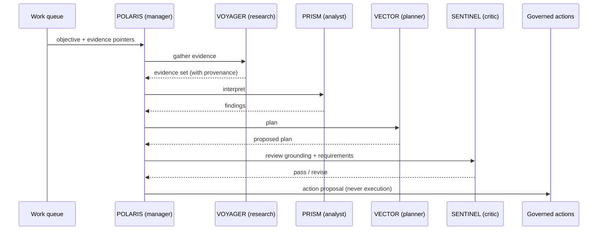

# Agent runtime

IRIS coordinates a small, fixed team of specialist agents. They are **bounded collaborators, not autonomous actors**. They reason, research, plan and critique, and they express everything as structured proposals and trace events.

## The team

| Agent | Role | Posture |
| --- | --- | --- |
| **POLARIS** | Manager and executive supervisor | Decides which authority owns a piece of work, decomposes it, delegates, integrates results |
| **VOYAGER** | Research | Gathers evidence from approved context only |
| **PRISM** | Analyst | Interprets evidence |
| **VECTOR** | Action planner | Produces dependency-aware plans |
| **SENTINEL** | Critic | Audits requirements, grounding and execution results |
| **SIGNAL** | Lead scorer | Evaluates opportunities |
| **NEXUS** | CRM manager | Maintains relationship and pipeline context |
| **FORGE** | Code specialist | The only role allowed to reach the action pipeline, and still governed |

## A team run



## POLARIS as supervisor

POLARIS is not an autonomous executive agent. It is a deterministic workflow with one bounded model seam:

1. take the next item from the prioritized queue under a durable lease;
2. read its Executive Policy assessment (priority, autonomy, risk, notification);
3. choose an execution target: a specialist agent, a durable workflow, a governed-action *proposal*, or a human;
4. optionally produce a short plan, which is validated and converted into a team plan that is validated again;
5. run deterministic invariant checks on the decision before anything executes;
6. record an episode and an evaluation record.

The decision is persisted, so a restarted process reuses it instead of deciding again.

## Runtime skills

Specialists act through **runtime skills**: versioned procedures with a declared capability, allowed tools and a verifier. Each skill has a machine-readable readiness (`production` or `evaluation`), enforced at runtime: an evaluation-only skill can be exercised in tests and Shadow Mode but is not selectable by production dispatch. A skill's verification outcome propagates upward instead of being hidden behind a raw result. Today one skill is production-ready and nine are evaluation-only.

## Goal, Plan and Action evaluation (GPA)

A verifier answers "is this result truthful?". GPA answers "does it achieve what was asked?":

| Level | When | Question |
| --- | --- | --- |
| **Action** | After each task produces a valid artifact, before it's recorded complete | Does this output do the task? |
| **Plan** | At admission and after each verified task | Does the evidence still support the remaining plan? |
| **Goal** | Before a run is recorded `completed` | Is every requested capability covered by verified work? |

An honest research packet that found nothing passes the verifier and still gets an Action-GPA `retry`. Verdicts drive a pure adaptive controller (`continue`, `complete`, `retry`, `reassign`, `replan`, `escalate`, `fail`) with fixed budgets: one task retry, a small replan budget declared by the plan, a bounded number of run segments. Anything exhausted or malformed escalates to a human. A bounded, run-local reflection step can inform a retry, but can't change permissions or policy.

Evaluation tiers: L0 runtime invariants always win; L1 deterministic rules are always on; an L2 model evaluator seam exists, can only tighten a verdict, and has no provider wired. When it would trigger, it is recorded as unavailable rather than faked.

## Execution seam

Specialist work goes through the existing team runtime. A framework-neutral `AgentRuntime` interface (start, resume, inspect, cancel) also exists, with an experimental LangGraph implementation proven on deterministic fixtures. It is not used in production routing; it needs durable checkpointing and a like-for-like comparison first.

## Competence contracts

Each role has a declared contract: what it is for, which tools it may use, its maximum permission class, which action types (if any) it may *propose*, and which procedures it may select. A role cannot widen that contract at runtime.

Roles move up a maturity ladder only with proof:

```
contracted → tool-connected → eval-proven → action-ready
```

- **Contracted**: the role has a schema-valid contract.
- **Tool-connected**: its tools resolve through real, tested paths.
- **Eval-proven**: it passes both positive and negative competence evals.
- **Action-ready**: it holds real, tested authority to cause an external effect. Only one role is at this level today, and its external effects run in controlled mode.

**Departments.** The executive contract already has a `department` target for delegating to a group of agents, but no department registry exists, so the Supervisor refuses that target at runtime.

## Agent state

 

Agents expose an observable state that the Agent Galaxy renders directly:

`idle` → `thinking` → `working` → `reviewing` → `waiting_for_approval` / `blocked` / `failed` / `done`

Hand-offs between agents are recorded as collaboration links, so you can see who delegated what to whom and why. See [`interfaces/agent-state.ts`](../interfaces/agent-state.ts).

## Isolation

The agent worker is a separate process with no database connection and no external-system SDKs. Even a compromised or confused agent can only emit proposals that the control plane validates, authorizes and traces.
