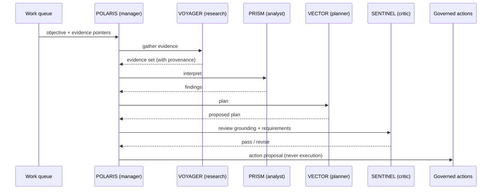
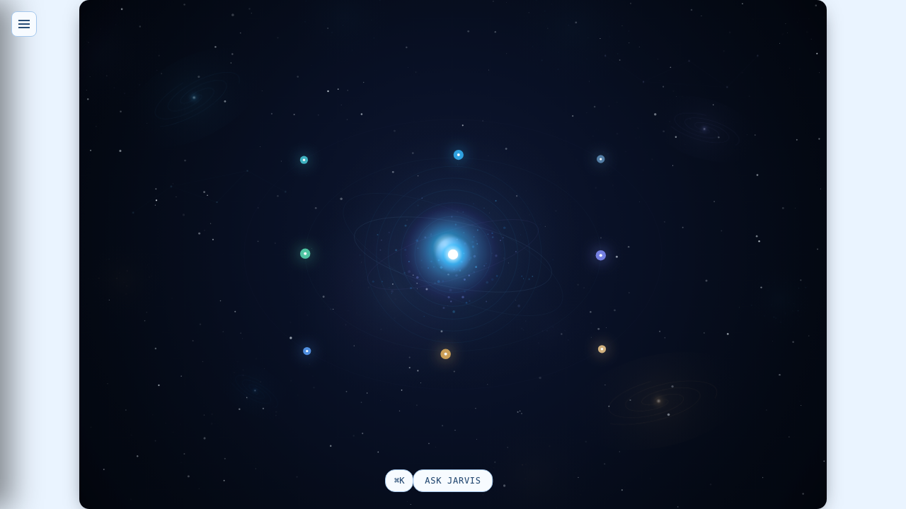
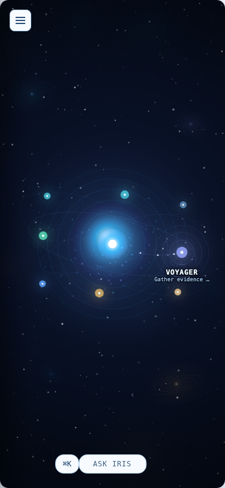

# Agent runtime

JARVIS coordinates a small, fixed team of specialist agents. They are **bounded collaborators, not autonomous actors**. They reason, research, plan and critique, and they express everything as structured proposals and trace events.

## The team

| Agent | Role | Posture |
| --- | --- | --- |
| **POLARIS** | Manager | Decomposes the objective, delegates, integrates results |
| **VOYAGER** | Research | Gathers evidence from approved context only |
| **PRISM** | Analyst | Interprets evidence |
| **VECTOR** | Action planner | Produces dependency-aware plans |
| **SENTINEL** | Critic | Audits requirements, grounding and execution results |
| **SIGNAL** | Lead scorer | Evaluates opportunities |
| **NEXUS** | CRM manager | Maintains relationship and pipeline context |
| **FORGE** | Code specialist | The only role allowed to reach the action pipeline, and still governed |

## A team run



## Competence contracts

Each role has a declared contract: what it is for, which tools it may use, its maximum permission class, which action types (if any) it may *propose*, and which procedures it may select. A role cannot widen that contract at runtime.

Roles move up a maturity ladder only with proof:

```
contracted → tool-connected → eval-proven → action-ready
```

- **Contracted**: the role has a schema-valid contract.
- **Tool-connected**: its tools resolve through real, tested paths.
- **Eval-proven**: it passes both positive and negative competence evals.
- **Action-ready**: it holds real, tested authority to cause an external effect. Only one role is at this level today.

## Agent state

 

Agents expose an observable state that the Agent Galaxy renders directly:

`idle` → `thinking` → `working` → `reviewing` → `waiting_for_approval` / `blocked` / `failed` / `done`

Hand-offs between agents are recorded as collaboration links, so you can see who delegated what to whom and why. See [`interfaces/agent-state.ts`](../interfaces/agent-state.ts).

## Isolation

The agent worker is a separate process with no database connection and no external-system SDKs. Even a compromised or confused agent can only emit proposals that the control plane validates, authorizes and traces.
