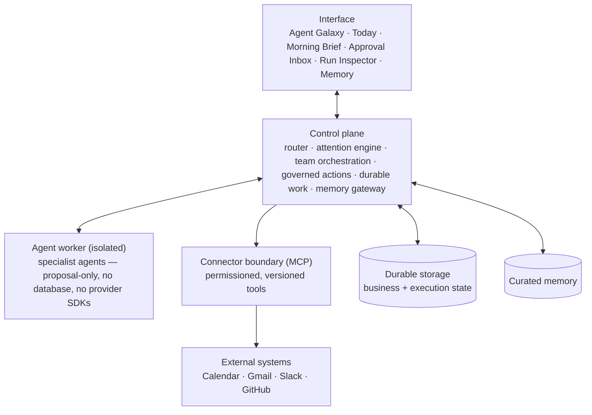

# Architecture

> Public edition. This describes how the system is organized, not how it is coded.

## Layers

- **Interface.** It renders a truthful projection of system state. The UI never guesses what an agent is doing; it shows what the runtime reports.
- **Control plane.** The single authority. Every capability, whether a workflow, an agent team, an action or a memory read, goes through one router and one permission model.
- **Agent worker.** Specialist agents run in an isolated process. They can reason and propose, but they have no database connection and no direct access to external systems. Their only output is structured proposals and trace events.
- **Connector boundary.** External systems are reached only through permissioned tools with declared permission classes and approval behavior. A connector is never a hardcoded API call.
- **Storage.** A port with swappable adapters (in-memory for development, PostgreSQL for durable state). Business data and execution state share one transactional boundary.
- **Memory.** Curated knowledge, accessed only through a gateway. Nothing writes it directly (see [memory-system.md](memory-system.md)).

## Core flows

1. **Attention.** Sources → collect and privacy-filter → deduplicate → evidence-backed scoring → bounded synthesis → validation → P0–P3 work queue. See [attention-system.md](attention-system.md).
2. **Team runs.** A work item becomes an objective. The manager agent delegates to specialists, the critic reviews, and the result is either an answer or an action proposal. See [agent-runtime.md](agent-runtime.md).
3. **Governed actions.** Proposal → policy decision → optional human approval → execute → verify → recover. See [recovery-model.md](recovery-model.md).
4. **Proactive runtime.** A scheduler wakes durable watches (follow-ups, deadlines) under explicit budgets, so proactive behavior can't run away.

## Architectural invariants

- **One of each.** One router, one attention engine, one action pipeline, one trace contract. A second competing path is treated as a defect, not as redundancy.
- **Contracts at every boundary.** Every cross-boundary payload is validated at runtime, not just type-checked.
- **Capability-gated live reasoning.** Model calls happen only at a small number of named boundaries. Each one is bounded in input and output and validated, and all of them can be switched off deployment-wide.
- **Truthful status.** Components report `ready`, `degraded` or `unavailable` with explicit limitations, instead of failing silently or pretending.

## Decision records

The private system is governed by a long series of architecture decision records covering storage, connectors, approvals, recovery, memory, agent orchestration and inference. They are not published, but the principles they encode are summarized in [design-principles.md](design-principles.md).
