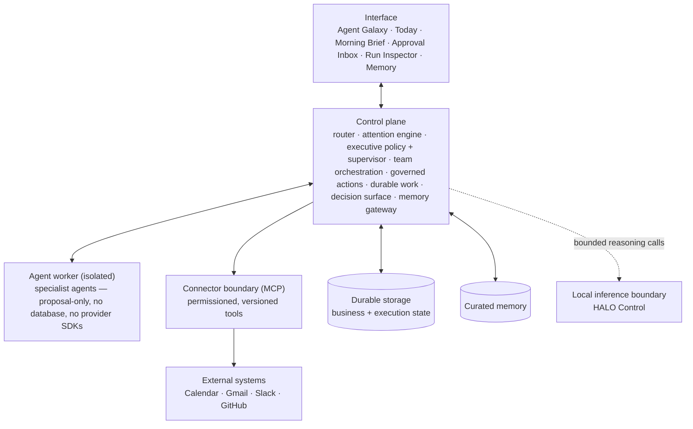
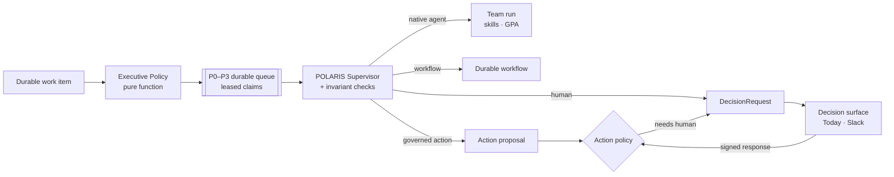

# Architecture

> Public edition. This describes how the system is organized, not how it is coded.

## Layers

- **Interface.** It renders a truthful projection of system state. The UI never guesses what an agent is doing; it shows what the runtime reports.
- **Control plane.** The single authority. Every capability, whether a workflow, an agent team, an action or a memory read, goes through one router and one permission model.
- **Agent worker.** Specialist agents run in an isolated process. They can reason and propose, but they have no database connection and no direct access to external systems. Their only output is structured proposals and trace events.
- **Connector boundary.** External systems are reached only through permissioned tools with declared permission classes and approval behavior. A connector is never a hardcoded API call.
- **Storage.** A port with swappable adapters (in-memory for development, PostgreSQL for durable state). Business data and execution state share one transactional boundary.
- **Memory.** Curated knowledge, accessed only through a gateway. Nothing writes it directly (see [memory-system.md](memory-system.md)).

## Core flows

1. **Attention.** Sources → collect and privacy-filter → deduplicate → evidence-backed scoring → bounded synthesis → validation. See [attention-system.md](attention-system.md).
2. **Executive decision.** Each piece of work becomes a durable work item. A pure Executive Policy assesses relevance, priority (P0–P3), risk, autonomy and notification; the POLARIS Supervisor then picks which *existing* authority owns it: a specialist agent, a workflow, a governed action proposal, or a human. The queue is durable and leased, so priority survives restarts.
3. **Team runs.** POLARIS delegates to specialists through runtime skills, the critic reviews, and GPA checks whether each result actually achieves the task. Failures are retried, reassigned, replanned or escalated under fixed budgets. See [agent-runtime.md](agent-runtime.md).
4. **Governed actions.** Proposal → policy decision → optional human approval → execute → verify → recover. See [recovery-model.md](recovery-model.md).
5. **Human decisions.** Approvals are transport-neutral `DecisionRequest`/`DecisionResponse` records. A chat surface (Slack, in controlled mode) only renders and transports them; the source runtime remains the only authority that can accept a decision or execute anything.
6. **Shadow Mode.** The same policy, Supervisor, skills and GPA can run counterfactually on read-only work. A fence keeps Shadow runs away from the production queue, the action runtime and every notification transport. See [evaluation.md](evaluation.md).
7. **Proactive runtime.** A scheduler wakes durable watches (follow-ups, deadlines) under explicit budgets, so proactive behavior can't run away.
8. **Governed learning.** Outcomes become candidate lessons that a human can promote into a specific asset. See [governed-learning.md](governed-learning.md).

## Architectural invariants

- **One of each.** One router, one attention engine, one action pipeline, one trace contract. A second competing path is treated as a defect, not as redundancy.
- **Contracts at every boundary.** Every cross-boundary payload is validated at runtime, not just type-checked.
- **Capability-gated live reasoning.** Model calls happen only at a small number of named boundaries. Each one is bounded in input and output and validated, and all of them can be switched off deployment-wide.
- **Truthful status.** Components report `ready`, `degraded` or `unavailable` with explicit limitations, instead of failing silently or pretending.
- **Models propose, the runtime authorizes.** No model output sets autonomy, grants a permission or approves an action.
- **Counterfactual is fenced.** Shadow execution is a persisted run mode checked at the dispatcher and the tool gateway, not a flag a caller can set.

## Decision records

The private system is governed by roughly eighty architecture decision records covering storage, connectors, approvals, recovery, memory, agent orchestration, executive policy, evaluation and inference. They are not published, but the principles they encode are summarized in [design-principles.md](design-principles.md).
