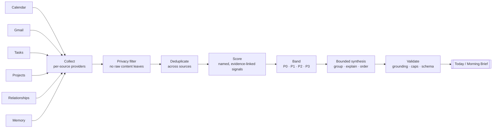
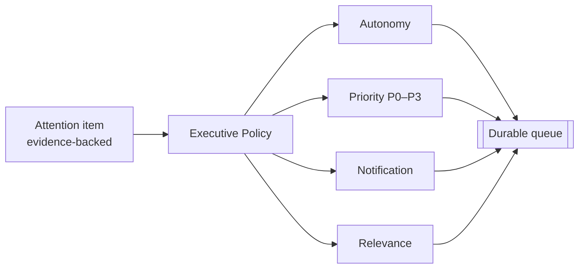

# Attention system

> North Star: **"What needs my attention today?"**

The attention system turns scattered signals into a short, defensible, evidence-backed list. It is the system's executive function. It decides what matters before anything decides what to do.

## Pipeline

1. **Collect.** Each source has a provider that returns candidate records together with its own health status (`ready` / `degraded` / `unavailable`). If one provider fails, the brief is still produced, with that gap stated explicitly.
2. **Privacy filter.** Only short, bounded summaries continue. Full email bodies, note bodies and event descriptions never enter the attention contract.
3. **Deduplicate.** The same obligation seen in an email, a task and a calendar invite becomes one item with several evidence references.
4. **Score.** Named signals contribute to a baseline score. Each signal points at the evidence that justifies it.
5. **Band.** Items fall into P0–P3.
6. **Bounded synthesis.** A model may group, explain and order only the pre-qualified set. It never executes anything, never sees raw source content, and its output is capped.
7. **Validate.** Every claim in the output must trace back to collected evidence, or the output is rejected.

## Priority bands

| Band | Intent |
| --- | --- |
| **P0** | Act now. Delay is costly or something is blocked. |
| **P1** | Handle today. |
| **P2** | Schedule this week. |
| **P3** | Background awareness only. Never interrupts. |

### What a band considers

- **Importance**: who and what is involved, and what it unblocks.
- **Urgency**: time pressure and deadlines.
- **Confidence**: how well the evidence supports the item.
- **Risk**: what goes wrong if it's ignored, or if it's acted on incorrectly.
- **Autonomy**: whether IRIS can resolve it itself, needs approval, or can only inform.
- **Notification relevance**: whether it deserves an interruption, or just a place on the list.

The production formula, the signal weights, the band thresholds and the output cap are intentionally not published.

## From attention to execution

Attention decides what matters. A separate, pure **Executive Policy** then decides what may happen next, over the same evidence:

- **Autonomy is computed first and independently of priority.** An unknown action is forbidden, a destructive one needs explicit confirmation, an external or irreversible one needs approval, and only the rest is autonomous-safe. A high priority never buys autonomy.
- **Relevance can drop work.** Known noise and low-band, non-actionable passive signals are marked irrelevant instead of cluttering the queue. A direct user request is always relevant.
- **Confidence can only be raised by trusted evidence.** A model's interpretation can lower it, never raise it.
- **Notification is its own decision:** silent, digest, notify, or decision required.

The result goes into one durable, prioritized work queue. Workers claim items with leases, so a P1 claimed by a worker that crashes is recovered and run once by the next one. While a P0 is in focus, new lower-priority work waits; already-running work is not preempted.

See [`interfaces/executive.ts`](../interfaces/executive.ts) for the illustrative `ExecutiveAssessment`.

## Guarantees

- **No evidence, no item.** The contract requires at least one source reference, so a fabricated priority can't be represented.
- **Memory can't manufacture obligations.** An item backed only by memory may lower confidence (stale, uncertain), but it can never claim urgency or a waiting person.
- **One ranking.** Today and the Morning Brief share the same upstream classification, so they can't disagree about the same item.
- **Capped output.** The brief is deliberately short. A long list is a failure of prioritization.
- **Honest coverage.** Every brief states which sources were covered and what its limitations are.

See [`interfaces/work-item.ts`](../interfaces/work-item.ts) for the illustrative contract.
