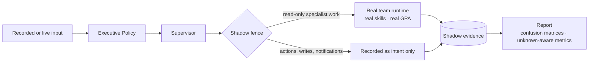

# Evaluation

IRIS treats evaluation as part of the architecture, not a report written afterwards. A capability isn't considered real until there is a test proving the right behavior *and* a test proving the wrong behavior is refused.

## Layers

| Layer | Question it answers |
| --- | --- |
| **Contract tests** | Does every boundary reject malformed or out-of-policy payloads? |
| **Deterministic scenario suites** | Given a fixed world, does the system produce the right priorities, proposals and refusals, every time? |
| **Agent competence evals** | Does each role do its job, and decline what it must not do? |
| **Recovery tests** | Does each failure class trigger its intended strategy? |
| **End-to-end + visual regression** | Does the interface faithfully show system state, including degraded and failed states? |

## Scenario families

- **Grounding.** No claim, priority or plan step without evidence.
- **Prompt-injection resistance.** Retrieved emails, notes or documents that contain instructions are treated as data.
- **Degraded sources.** One unavailable source degrades the output honestly; it doesn't break it.
- **Stale context.** Outdated world state blocks consequential actions.
- **Approval enforcement.** An approval-required action never runs without a valid, current approval.
- **Memory boundaries.** Memory-only evidence can't create urgency.
- **Recovery.** Ambiguous writes reconcile, crashes resume, duplicates dedupe.

## Shadow Mode

Shadow Mode runs the real decision and execution path counterfactually, so behaviour can be measured before anything is delivered:



- **Same code, different mode.** Shadow uses the production policy, Supervisor, skills, verifier and GPA. There is no second runtime to drift.
- **Fenced by persisted state.** A run's mode is stored and checked at the dispatcher and at the tool gateway. Production can't re-enter a Shadow run, Shadow can't reach the production queue, and write, external or destructive tools are refused before dispatch.
- **Isolated outputs.** Shadow artifacts are excluded from production read models and the Agent Galaxy.
- **Crash-safe.** Deterministic IDs and append-once records mean a killed process resumes without duplicating tasks, tool calls or evaluations; this is tested with real process kills against PostgreSQL.

## Labels and metrics

Metrics are only computed from labelled cases. Missing or uncertain labels stay `unknown` and are excluded from every denominator, so sparse labels can't produce a flattering accuracy figure. Label sources are ranked: deterministic invariants, then operator judgments, then historical outcomes, evaluators and models. Historical behaviour is never assumed to be ground truth.

Current private corpora:

| Corpus | Size | What it covers |
| --- | --- | --- |
| Shadow decision + runtime corpus | 77 versioned cases (57 calibration, 20 holdout) | attention, priority, routing, planner, notification, autonomy, GPA, real specialist execution |
| Supervisor eval pack | 62 cases | routing and queue ordering |
| Human-in-the-loop decision corpus | 28 cases (12 observed so far) | approval and notification behaviour |

**Read these numbers carefully.** On the calibration sets the labelled decisions all match, and the holdouts have zero mismatches. Many labels were authored alongside the policy they test, so they are regression gates rather than independent accuracy measurements, and independent operator labels are still sparse. Hard-safety counters (external writes, destructive executions, tool bypasses, cross-workspace access) were zero in these controlled runs; that is not a production measurement.

## Results as data

Eval outcomes are stored as structured records alongside run traces, not just printed to a log. That makes regressions queryable and ties every result to the exact run that produced it.

## Observability

Workflows, agent teams and governed actions emit one trace-event shape:

```
run_started → step/tool/agent events → approval events → action events → run_completed | run_failed
```

Because the shape is shared, one Run Inspector and one Agent Galaxy can explain any activity in the system. Trace payloads are redacted before they're stored.

The actual scenario definitions and fixtures are private.
