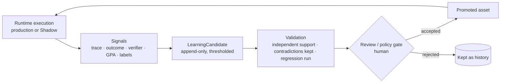

# Governed learning

IRIS is meant to get better with use, but it doesn't modify itself. Every run can produce evidence that something should change, and the change itself always goes through a review gate into a specific, versioned asset.

## The loop

1. **Runtime execution.** Production runs and Shadow runs (see [evaluation.md](evaluation.md)) both emit structured evidence: trace events, skill outcomes, verifier results, GPA verdicts, human decisions and overrides.
2. **Signals.** Evidence is aggregated deterministically. Unlabelled outcomes stay `unknown`; they don't count for or against anything.
3. **Candidate lesson.** A repeated pattern above a threshold becomes a `LearningCandidate`: the pattern, the asset it would change, and its support. Production and Shadow evidence are counted separately, and contradicting evidence is stored next to supporting evidence instead of being averaged away.
4. **Validation.** A candidate needs independent support. The change it proposes has to be expressible as something testable, usually a regression case first.
5. **Review gate.** A human decides. Policy, skills, memory and permissions can't be edited by the loop itself.
6. **Promotion** into one durable asset, versioned like code.
7. **Future execution** uses the new version, and the loop measures it again.

## Where a lesson can land

| Asset | Example |
| --- | --- |
| Regression case | "This calendar-conflict shape must produce a P1 with an approval request" |
| Skill revision | A procedure step added to a research skill, with a new version |
| Routing rule | A capability mapped to a different specialist |
| Prompt / rule | A tighter output contract for one bounded model call |
| Semantic memory | A reviewed fact about a person or project |
| Procedural memory | A reviewed "how we do X" procedure |
| Policy | A change to an executive or action policy, versioned |
| Runbook | An operator procedure for a failure mode |

## What the loop can't do

- **Promote itself.** Candidates have exactly one state today: `candidate`. Nothing transitions them automatically.
- **Learn from Shadow alone.** Counterfactual evidence can support a candidate but can't promote one.
- **Widen authority.** No lesson can raise an agent's permission ceiling, change an action's autonomy level, or authorize an action.
- **Turn feedback into rules.** Free-form human feedback (for example on a "request changes" decision) is stored as evidence. It never becomes policy or memory as a side effect.

## Status

| Stage | State |
| --- | --- |
| Structured signals (traces, skill outcomes, verifier, GPA, decisions) | Implemented |
| Deterministic aggregation into `LearningCandidate` records | Implemented, evaluated in Shadow Mode |
| Production vs Shadow separation, contradiction retention | Implemented, tested |
| Review UI and promotion workflow | Not implemented |
| Automatic promotion | Not implemented, by design |

See [`interfaces/executive.ts`](../interfaces/executive.ts) for the illustrative `LearningCandidate` contract.
