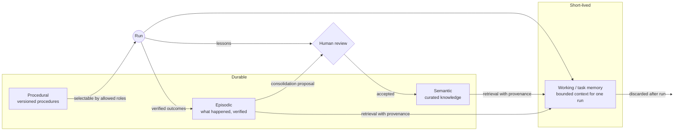

# Memory system

IRIS treats memory as several stores with different trust levels, not one big vector database. Operational state, execution history and curated knowledge are kept strictly apart.

## Four kinds of memory

| Kind | Holds | Written by | Lifetime |
| --- | --- | --- | --- |
| **Working / task** | The bounded context pack a run actually sees | Assembled per request | Discarded after the run |
| **Episodic** | Events, decisions, outcomes, with timestamps | Verified runs and actions | Durable, append-only |
| **Semantic** | Facts about people, projects, preferences | Reviewed proposals only | Durable, curated |
| **Procedural** | Versioned, verified procedures ("skills") | Registered procedures | Durable, versioned |

## Every record carries

- **Scope**: which workspace, subject and privacy ceiling it belongs to.
- **Provenance**: where it came from (source, run, actor), so any use of it can be traced back.
- **Timestamps**: when it was observed, recorded, and last confirmed.
- **Confidence**: how much weight it deserves. Stale or uncertain memory is marked, not silently trusted.

See [`interfaces/memory.ts`](../interfaces/memory.ts).

## Writing: proposals, not writes

No agent and no runtime path writes long-term memory directly. New knowledge enters as a **proposal** with evidence, and a human reviews it before it becomes durable. This keeps the knowledge base curated and keeps a confident but wrong agent from polluting it.

## Retrieval

Retrieval is a gateway, never filesystem or database access from a caller. It respects the caller's privacy ceiling, returns provenance with every result, and assembles a bounded context pack for the current run. Indexes are *derived*: they can be rebuilt from source and are never treated as the system of record.

## Consolidation

The design distils episodic history into candidate semantic facts and procedural lessons, always as **proposals** subject to the same review. Today the implemented part is narrower: decision outcomes are aggregated into `LearningCandidate` records (see [governed-learning.md](governed-learning.md)). Automatic consolidation into semantic or procedural memory is not implemented.

## Memory vs other state

Memory is easy to confuse with things that merely persist. IRIS keeps them apart:

| Kind | Purpose | Is it memory? |
| --- | --- | --- |
| Working / task memory | What one run sees | Yes, short-lived |
| Episodic memory | Verified decisions, episodes and outcomes | Yes |
| Semantic memory | Reviewed facts | Yes |
| Procedural memory | Versioned runtime skills and procedures | Yes |
| Run state | Where a run is (status, current step, lease) | No: execution state |
| Checkpoints | What a resumed run needs to continue without repeating effects | No: recovery state |
| Artifacts and logs | Outputs and traces, with provenance | No: evidence that memory can cite |

## Implementation status

| Kind | State |
| --- | --- |
| Working / task memory | Implemented: bounded, scoped context packs |
| Episodic | Implemented: append-only executive episodes and outcomes |
| Semantic | Proposal-only write path and reviewed curated store implemented; not yet wired into the executive layer's reader |
| Procedural | Implemented as runtime skills (one production-ready, nine evaluation-only) |

Memory never authorizes anything. Shadow Mode measures whether relevant memory helps a read-only specialist; one real comparison so far was neutral, and helped/hurt verdicts need stronger outcome labels before they're claimed.

## Boundaries

- Memory can lower confidence in an item; it can never, on its own, make an item urgent (see [attention-system.md](attention-system.md)).
- Retrieved memory is *data*, never instructions. Content that tries to direct the system is treated as a prompt-injection attempt.
- Cloud deployments that aren't allowed to see local memory report memory as `unavailable` instead of silently degrading.

Production retrieval heuristics, indexing and ranking strategies, and all actual memory content are private.
