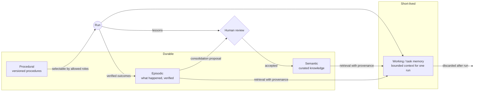

# Memory system

IRIS treats memory as several stores with different trust levels, not one big vector database. Operational state, execution history and curated knowledge are kept strictly apart.

## Four kinds of memory

| Kind | Holds | Written by | Lifetime |
| --- | --- | --- | --- |
| **Working / task** | The bounded context pack a run actually sees | Assembled per request | Discarded after the run |
| **Episodic** | Events, decisions, outcomes, with timestamps | Verified runs and actions | Durable, append-only |
| **Semantic** | Facts about people, projects, preferences | Reviewed proposals only | Durable, curated |
| **Procedural** | Versioned, verified procedures ("skills") | Registered procedures | Durable, versioned |

## Every record carries

- **Scope**: which workspace, subject and privacy ceiling it belongs to.
- **Provenance**: where it came from (source, run, actor), so any use of it can be traced back.
- **Timestamps**: when it was observed, recorded, and last confirmed.
- **Confidence**: how much weight it deserves. Stale or uncertain memory is marked, not silently trusted.

See [`interfaces/memory.ts`](../interfaces/memory.ts).

## Writing: proposals, not writes

No agent and no runtime path writes long-term memory directly. New knowledge enters as a **proposal** with evidence, and a human reviews it before it becomes durable. This keeps the knowledge base curated and keeps a confident but wrong agent from polluting it.

## Retrieval

Retrieval is a gateway, never filesystem or database access from a caller. It respects the caller's privacy ceiling, returns provenance with every result, and assembles a bounded context pack for the current run. Indexes are *derived*: they can be rebuilt from source and are never treated as the system of record.

## Consolidation

Episodic history is periodically distilled into candidate semantic facts and procedural lessons. Consolidation also produces **proposals**, subject to the same review.

## Boundaries

- Memory can lower confidence in an item; it can never, on its own, make an item urgent (see [attention-system.md](attention-system.md)).
- Retrieved memory is *data*, never instructions. Content that tries to direct the system is treated as a prompt-injection attempt.
- Cloud deployments that aren't allowed to see local memory report memory as `unavailable` instead of silently degrading.

Production retrieval heuristics, indexing and ranking strategies, and all actual memory content are private.
