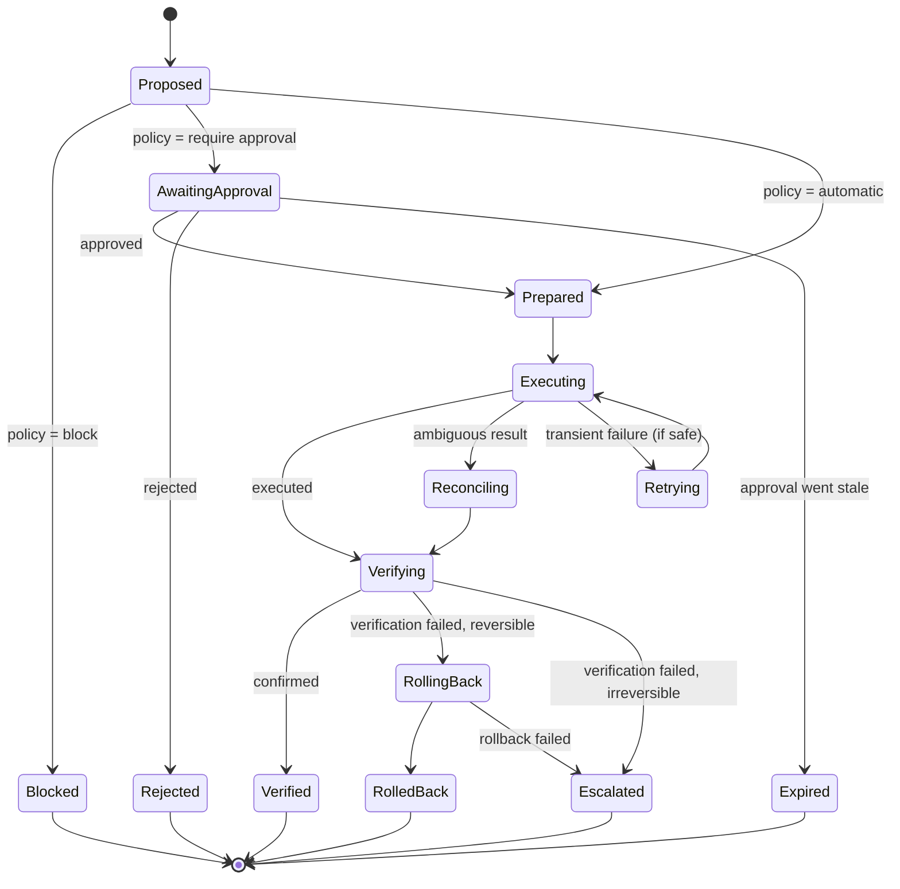

# Recovery model

Every consequential action goes through one governed pipeline. The aim isn't to never fail. It's to **never fail silently, never duplicate a side effect, and never report success that wasn't verified**.

## Lifecycle

**prepare → execute → verify → retry if safe → roll back if possible → escalate when required**

## Classifying actions

Actions are classified along two independent axes:

| | **Reversible** | **Irreversible** |
| --- | --- | --- |
| **Automatic** | Internal, low-risk changes (for example, reorganizing the work queue) | Rare, and only when the effect is purely internal |
| **Approval-required** | External changes that can be undone (for example, moving a meeting) | External, one-way effects (for example, sending an email) |

On top of that sits an **autonomy ladder**. Every action type is assigned exactly one level when it is registered. The level descriptions below are an illustrative summary:

| Level | Posture |
| --- | --- |
| A0 | Read-only, always automatic |
| A1 | Internal and low-risk, automatic |
| A2 | Consequential, approval required |
| A3 | High-impact, approval with extra scrutiny |
| A4 | Destructive, blocked with no approval path in this phase |

A model's reasoning can't change which level applies. Which action types sit at which level is production policy and isn't published.

## Failure strategies

Each failure class maps to one explicit strategy. Nothing is "retry everything".

| Failure class | Strategy |
| --- | --- |
| Transient provider timeout | Bounded retry |
| Rate limiting | Defer until allowed |
| Ambiguous write (did it happen?) | Reconcile by re-reading state, never blind resend |
| Storage interruption | Fail closed; no partial commits |
| Process crash | Durable resume without duplicating effects |
| Stale approval | Require a fresh approval |
| Stale world context | Block the action; don't act on outdated state |
| Verification failure | Not completed: roll back if reversible, escalate otherwise |
| Duplicate event or scheduler tick | Idempotent dedupe |
| Budget exhausted | Defer or suppress; never exceed the bound |
| Reasoning unavailable | Route to clarification; never guess |

## Invariants

- **Propose ≠ authorize.** Agents can only propose.
- **Unknown fails closed.** An unregistered action type is blocked.
- **Execution and verification are separate facts.**
- **Single owner.** Durable leases ensure only one worker drives an action at a time; a restart resumes from the last checkpoint.
- **Approvals are bound to a single run and they expire.**

See [`interfaces/approval.ts`](../interfaces/approval.ts) and [`interfaces/execution.ts`](../interfaces/execution.ts).
